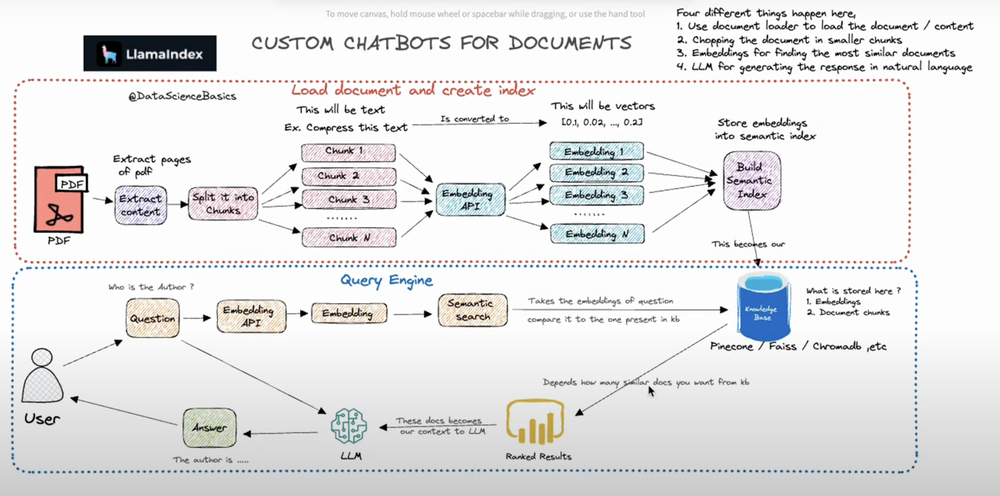

# Welcome to: Building AI Applications with Open-Source Models

Videos explaining how everything works can be found in the [course on gumroad](https://christophergs.gumroad.com/l/texhy).

## Local Setup

- Ensure you have Python >3.11,<3.12 installed. **Do not use Python 3.12** as
  some dependencies do not support it yet.
- Ensure you have git installed
- (Optional but recommended): Create a virtual environment
- Run `pip install -r requirements.txt`
- Get mistral model Inside `data` directory
  - `cd data`
  - `wget https://huggingface.co/TheBloke/Mistral-7B-Instruct-v0.2-GGUF/resolve/main/mistral-7b-instruct-v0.2.Q4_K_M.gguf`
  - 

## Part 2 Setup

- Download a small model appropriate for your system from here: https://huggingface.co/TheBloke/TinyLlama-1.1B-Chat-v0.3-GGUF
- Ensure you download the file as a .gguf file (see course for details)
- Save the file to the `data` directory and name it: tinyllama.guff
- Download the larger model

## Key Commands

* From ` ai-engineering-course` run `PYTHONPATH=. python part_3_rag/rag.py`
* 
* Run Evaluations, Hallucinations, and Tests
  * `PYTHONPATH=. pytest part_4_eval/test_llm.py`
  * Debug Inside `test_data/test_summary_score.json`
* Run API Inference
  * `cd project_api_infernce` `python scripts/together_inference.py`
    * Stream results will display in the console.
